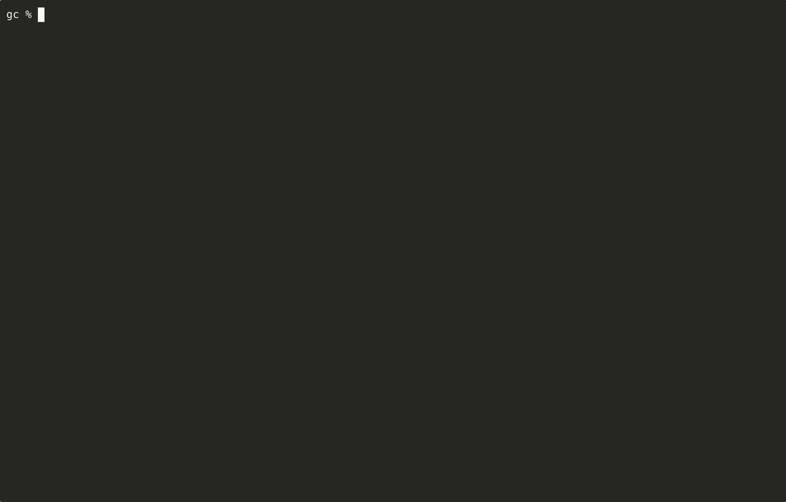

# GC Analysis in Kubernetes Deployments

The goal of the project is to configure cpu and memory constraints in deployment spec and understand the gc logs for simple application. 

- Capture the gc logs for different version of same application.
- Understand behaviour of different GC.
- Persist data of gc for future comparative analysis. 
  - Stream GC data to kafka
  - Perist the gc data to a timeseries db
- Comparative analysis to determine if the base deployment and testing shows any memory usage and gc anamolies.
  - Dashboard to view the gc trend.
  - Comparative analysis using `plotly`.

## Prerequiste - Setup

- K3d
- docker
- gradle
- JDK 17, JDK 21 (Use tools like asdf to manage) 
- Helm
- asciinema, agg, gifski ( Command execution gif )

All the application are developed as a cloud native Kubernetes deployment.  The applications are deployed in K3d cluster with `FluentBit` use to catpture logs to either log to a local file or to external source either Kafka/Elasticsearch for future analysis.

[Setup](setup.md)

## Development, Build and Deployment

The process is common for all the application with the application name is a paramater to build process for each analysis.

By default the image is build in JDK 17 , the gradle image is `gradle:8.4-jdk17` and runtime image is `azul/zulu-openjdk:17.0.15-17.58`. To use specific gradle and runtime jdk base image pass these as build argumewnts for example

### Development Process Help Commands

The below only list command for application build process.

```bash
❯ make help

Available commands:
  app.logs             📜 Show logs from pod
  app.pods             🔍 Get pod name for release
  app.service          🌐 Show service endpoint
  build                🛠️ Build Docker image for given app
  check_app_name       🧪 Ensure APP_NAME is set and folder exists
  helm.image           🔍 Show deployed image from Helm
  helm.install         📦 Install Helm chart
  helm.template        🔍 Dry-run Helm rendering
  helm.uninstall       ❌ Uninstall Helm release
  helm.upgrade         🔁 Upgrade Helm chart
  help                 📘 Show this help message
  inspect              🖼️ Print and inspect the image
  publish              🚀 Build, tag and push image
  push                 📤 Push the image to local registry
  tag                  🔖 Tag the built Docker image

```


### Build and publish the image to local docker respository**
  
```bash
# Default build using JDK 17 version
make build publish APP_NAME=gc-app1-jdk17 VERSION=latest GRADLE_IMAGE=gradle:8.4-jdk17 RUNTIME_IMAGE=azul/zulu-openjdk:17.0.15-17.58

# To use JDK 21
make build publish APP_NAME=gc-app1-jdk17 GRADLE_IMAGE=gradle:8.4-jdk21 RUNTIME_IMAGE=azul/zulu-openjdk:21.50.19-ca-jdk

```

### Deploy the application and verify


- Pods, Service and Logs of deployed apps




### GC Analysis

