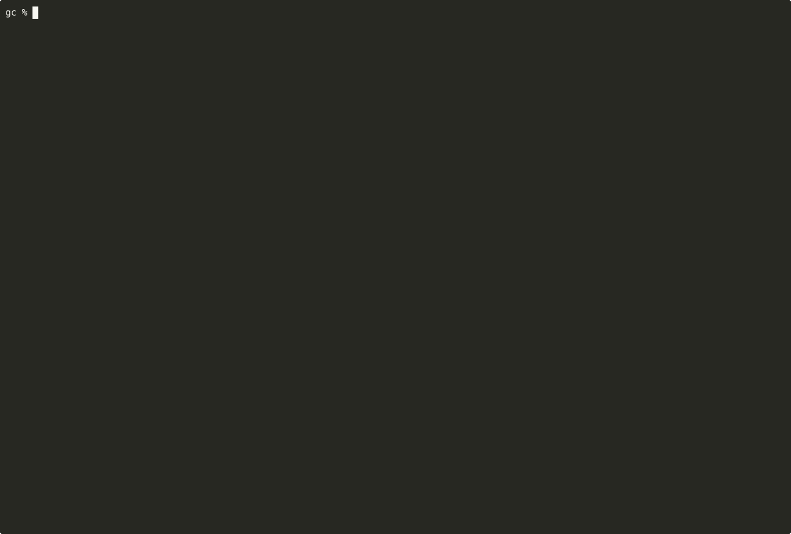

# Setup

## Prerequiste

- K3d
- docker
- gradle
- JDK 17, JDK 21 ( Use tools like asdf to manage) 
- Helm
- asciinema, agg, gifski ( Command execution gif )

## Development Guide

### Help Command

The help command will display all the project specific command that is needed for bootstrapping the application, running test and cleaning up the resources.

```bash
❯ make help

Available commands:
  app.logs             📜 Show logs from pod
  app.pod              🔍 Get pod name for release
  app.service          🌐 Show service endpoint
  build                🛠️ Build Docker image for given app
  calico.init          🧬 Initial Calico CNI
  calico.test          🧪 Wait for Calico pods to be ready
  check_app_name       🧪 Ensure APP_NAME is set and folder exists
  clean                🧹 Remove Docker images
  create.cluster       🚀 Create K3d cluster with custom registry
  create.network       🌐 Create a K3d network
  delete               🧹 Delete resources created.
  delete.cluster       🧹 Delete the k3d cluster and registry
  delete.network       ❌ Delete a K3d network
  describe.cluster     🔍 Describe the k3d cluster
  get.nodes            📋 List Kubernetes nodes
  helm.image           🔍 Show deployed image from Helm
  helm.install         📦 Install Helm chart
  helm.template        🔍 Dry-run Helm rendering
  helm.uninstall       ❌ Uninstall Helm release
  helm.upgrade         🔁 Upgrade Helm chart
  help                 📘 Show this help message
  init                 🧰 Initialize the resources needed
  inspect              🖼️ Print and inspect the image
  kubeconfig           🧾 Merge kubeconfig and switch context
  publish              🚀 Build, tag and push image
  push                 📤 Push the image to local registry
  start.registry       🏁 Start Docker registry using Compose
  stop.registry        🛑 Stop Docker registry
  tag                  🔖 Tag the built Docker image

```

### Create the infrastructure

The infrastructure for application is 

- K3d Cluster
- Docker Registry

The command will create necessary infrastructure for the application




###  Build , Publish, Deploy 

By default the image is build in JDK 17 , the gradle image is `gradle:8.4-jdk17` and runtime image is `azul/zulu-openjdk:17.0.15-17.58`. To use specific gradle and runtime jdk base image pass these as build argumewnts for example


- **Build and publish the image to local docker respository**
  
```bash
# Default build using JDK 17 version
make build publish APP_NAME=gc-app1-jdk17 VERSION=latest GRADLE_IMAGE=gradle:8.4-jdk17 RUNTIME_IMAGE=azul/zulu-openjdk:17.0.15-17.58

# To use JDK 21
make build publish APP_NAME=gc-app1-jdk17 GRADLE_IMAGE=gradle:8.4-jdk21 RUNTIME_IMAGE=azul/zulu-openjdk:21.50.19-ca-jdk

```

* **Deploy the application**


* Pods, Service and Logs of deployed apps


### Cleanup the resource 

